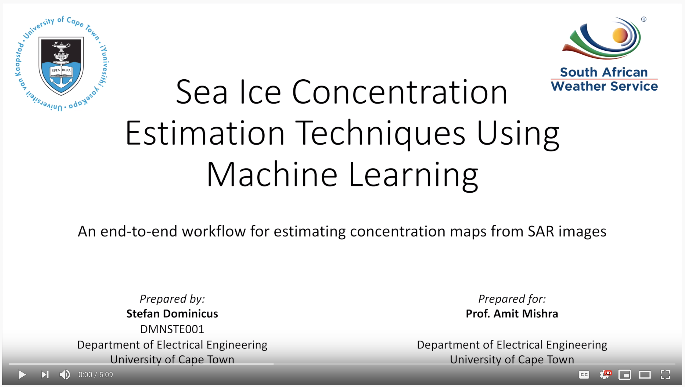

# Final Year Project
BSc(Eng) Mechatronics, University of Cape Town

## Project Title
Machine learning applied to sea ice concentration estimation from SAR data.
An end-to-end workflow for estimating concentration maps from SAR images.

## What's Here
This repo contains all the Python notebooks used in this project, the batched datasets used for training and evaluation, some of the trained model files, the project report, and the project poster.

## Abstract

<i>Sea ice concentration is an important metric used to characterise polar sea ice behaviour. Understanding this behaviour and accurately representing it is of critical importance for climate science research, and also has important uses in the context of maritime navigation. Current models used to estimate concentration maps are derived from passive microwave radar satellite data, but these instruments offer poor spatial resolutions, and are susceptible to interference due to atmospheric variations. Additionally, these models are usually calibrated for Arctic conditions, and evidence from recent in situ observations in the Southern Ocean suggests that their estimates are significantly biased and are not reliable in the Antarctic marginal ice zone. An end-to-end workflow for generating learned concentration estimation models from synthetic aperture radar data, trained on existing passive microwave data, is presented here. A novel objective function was introduced to account for uncertainty in the passive microwave measurements, which can be extended to account for arbitrary sources of error in the training data, and a recent set of in situ observations was used to evaluate the reliability of the chosen passive microwave concentration estimation model. Google Colaboratory was used as the development platform, and all notebooks, training data, and trained models are available on GitHub.</i>

